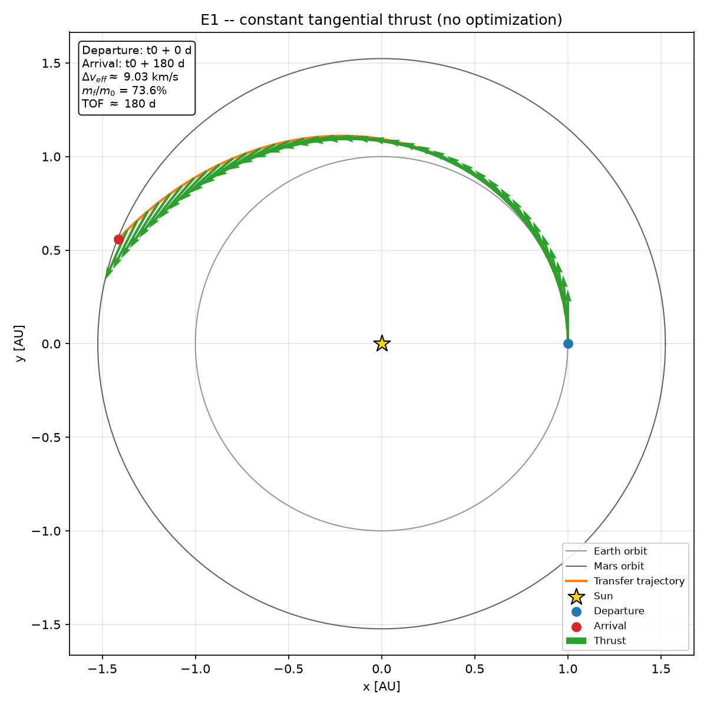
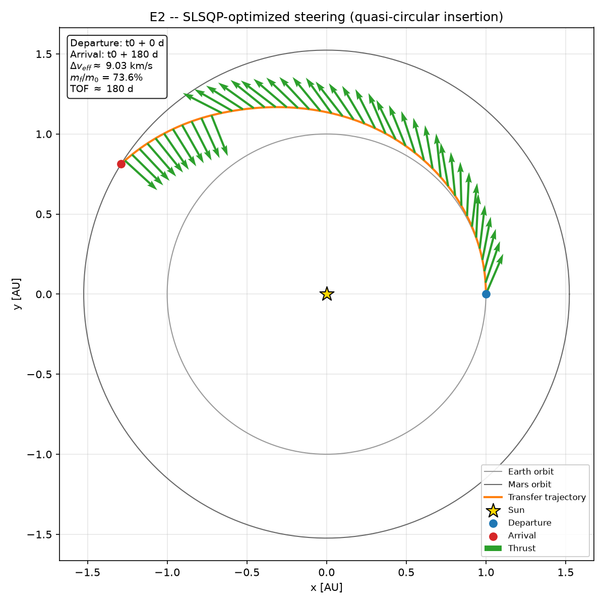
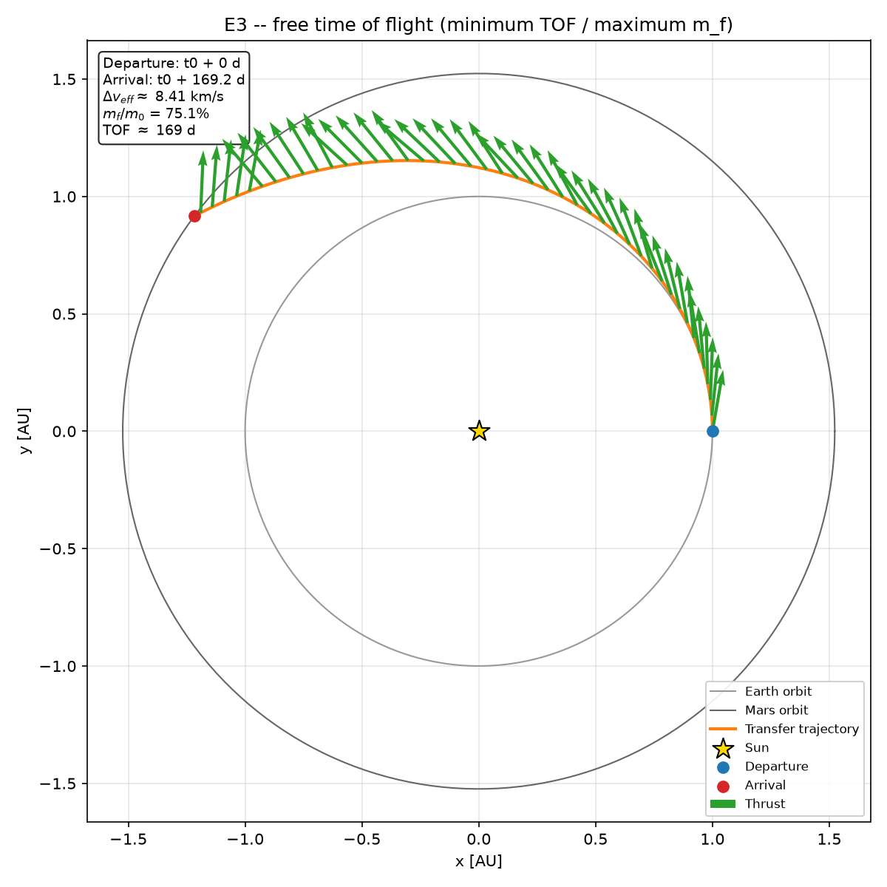
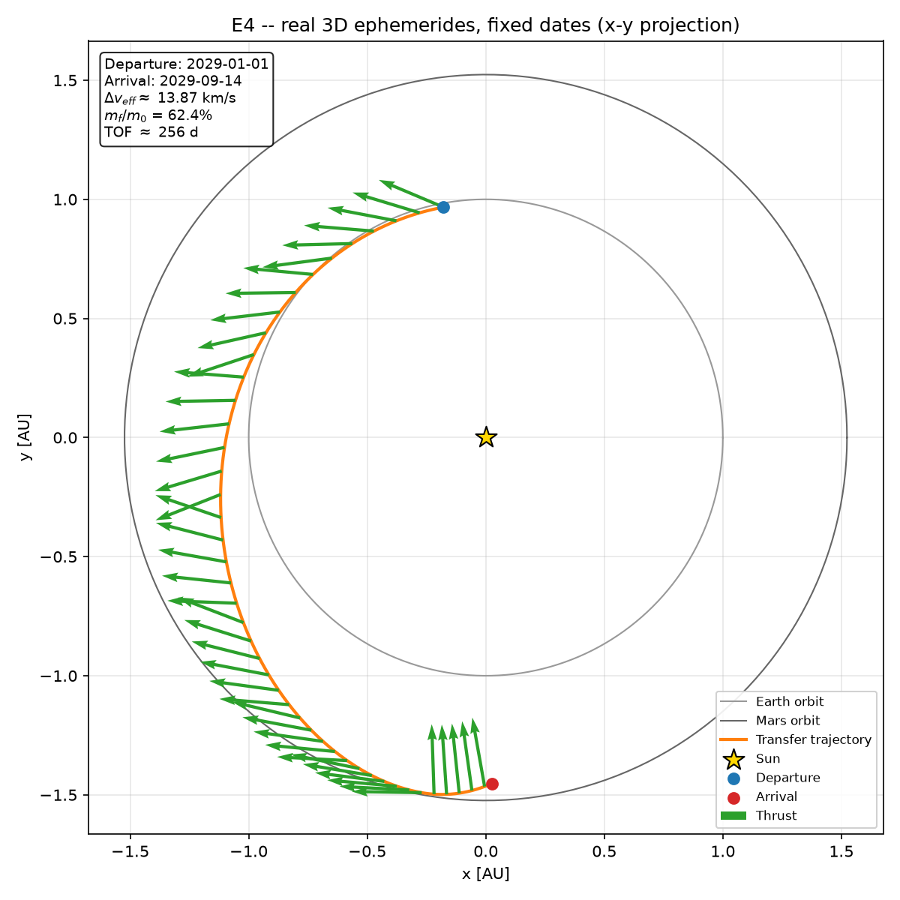
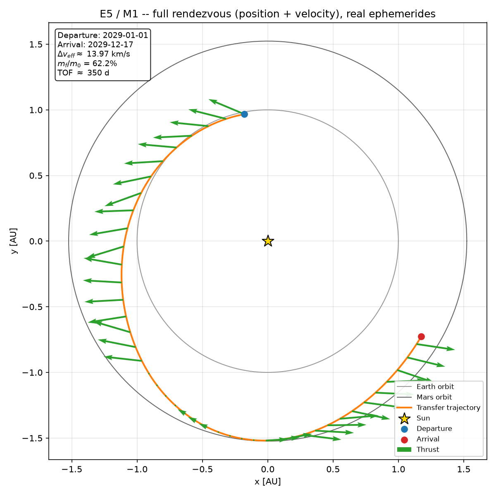

<div align="center">

# 🛰️ helios-solver

**GPU-accelerated optimization of low-thrust spacecraft trajectories.**

[](LICENSE)
[](pyproject.toml)
[-brightgreen.svg)](PLAN.md)

</div>

---

## Abstract

Electric propulsion thrusters (ion, Hall-effect) don't fire in short impulsive
burns — they push continuously, for months, at millinewton-scale thrust. The
optimal trajectory for this regime isn't a Hohmann ellipse; it's a continuous
**low-thrust spiral** whose throttle and steering profile has to be discovered
by solving a non-convex optimal control problem.

This is fundamentally a *software* problem, not a physics one. The equations
of motion have been known since Tsiolkovsky; the [Global Trajectory
Optimisation Competition](https://sophia.estec.esa.int/gtoc_portal/) (GTOC —
ESA/JPL's "orbital mechanics olympics") is won by the teams with the best
optimization engineering, parallelization, and compute budget.

**Thesis:** an engineer with a home GPU can compete in this space by building
better solvers — specifically, by using a neural surrogate to evaluate
trajectory segments in microseconds instead of numerically integrating them,
freeing the global search to spend its time on promising candidates instead
of on integrating ODEs for bad ones.

```
State:       x(t) = [r, v, m]            (position ∈ ℝ³, velocity ∈ ℝ³, mass)
Control:     u(t) = [T, α, β]            (thrust magnitude + direction)
Dynamics:    ṙ = v
             v̇ = -μ r/|r|³ + (T/m) û     (solar gravity + thrust)
             ṁ = -T/(Isp · g₀)           (propellant consumption)
Subject to:  0 ≤ T ≤ T_max
             x(t₀) = Earth state at t₀
             x(t_f) = Mars state at t_f  (full rendezvous: position AND velocity)
Objective:   max m(t_f)                  (arrive with maximum remaining mass)
```

The full problem write-up, the difficulty analysis (why this is non-convex,
chaotic, and expensive to evaluate), and the neural-surrogate research plan
live in [`IDEA.md`](IDEA.md). The task-by-task execution plan with acceptance
criteria and phase gates lives in [`PLAN.md`](PLAN.md). Both are written in
Spanish — the author's working language for design docs; this README is the
English-language entry point for the rest of the world.

## Status

🎯 **M1 reached — Phase 1 complete.** A real Earth→Mars low-thrust
rendezvous, departing Earth's *actual* position on 2029-01-01 and
matching both Mars's *actual* position **and** velocity on 2029-12-17:
position error 1.67 km, velocity error 0.0002 m/s (the acceptance
criterion is 1000 km / 1 m/s — cleared with 3+ orders of magnitude to
spare), verified by high-precision re-integration (`rtol=1e-12`, T-1.9)
before being trusted. Phase 0's gate is closed too: ephemerides,
dynamics, and the Hohmann/energy-conservation oracles are implemented
and green in CI, verified to ~10 m against live JPL Horizons — see
[`docs/adr/0001`](docs/adr/0001-orbital-mechanics-library.md).


The mass fraction delivered (62.2%) is below the ~80% PLAN.md uses as an
efficient-trajectory sanity check — expected and flagged, not hidden:
the search starts from an always-full-throttle seed, which PLAN.md's own
diagnostic already names as the signature of "control ineficiente."
Closing that gap is explicitly Phase 2 (global search) and T-1.5
(multi-start) work, not this milestone's job — M1's bar is rendezvous
*precision*, and that's cleared by a wide margin. See [`PLAN.md`](PLAN.md)
for the full task-level status and [Roadmap](#roadmap) below for what's
next.

<details>
<summary>How M1 was built: the five realism-ladder rungs (click to expand)</summary>

| | |
|---|---|
|  | **E1** — a purely tangential, always-on thrust spiral from Earth's orbit, integrated with the actual `dynamics.py` equations of motion. No optimizer involved; it crosses Mars's orbital radius by construction (TOF chosen for that), not a rendezvous. |
|  | **E2** — same thrust magnitude and time of flight as E1, but the steering angle per segment is now optimized by SLSQP (minimum control effort subject to hard terminal constraints), reliably hitting a genuine quasi-circular insertion at Mars's orbital radius (matches both radius and speed, not just radius) from every seed tested. The *steering profile* that achieves it isn't unique, though — see the note below. |
|  | **E3** — same quasi-circular insertion target as E2, but the time of flight is now also a decision variable, and the objective is genuine (minimize TOF, which — with thrust magnitude fixed — is literally the same thing as maximizing final mass, the project's actual objective). Converges to TOF ≈ 169.2 days (vs. E2's fixed 180) with m_f/m_0 ≈ 75.1% (vs. E2's 73.6%), and — unlike E2 — to the *same* optimum from every seed tested, because the objective is well-posed instead of a degenerate proxy. |
|  | **E4** — first rung using real ephemerides instead of idealized circular orbits: departs Earth's actual position/velocity on 2029-01-01 and targets Mars's actual position on 2029-09-14 (a launch window checked for realistic geometry beforehand — ~170.6° Earth-Sun-Mars transfer angle, close to Hohmann's ideal 180°, not an arbitrary date pair). Control is genuinely 3D (in-plane *and* out-of-plane steering) since real orbits aren't coplanar. Reaches Mars's real position within ~6 km. Position only, not velocity — that's E5. |
|  | **E5 / M1** — full rendezvous: same 2029-01-01 departure, but now matching Mars's *actual* velocity too, not just position. The E4 launch window (256 days) turned out to be too short for this — no amount of segments, seeds, or throttle closed a combined position+velocity match; an isolation test (matching velocity alone) converged perfectly, which ruled out a units bug and pointed at reachability instead. A TOF sweep confirmed 350–400 days (the range PLAN.md's own reference case already named) works. Solved in two stages: a direction-only soft-objective warm start, then a hard-constraint, throttle-free refinement maximizing final mass from that seed. |

**A finding worth stating plainly:** E2's optimal steering profile is *not
unique* — different SLSQP seeds reliably satisfy the same terminal
constraints but land on different control profiles (confirmed across
three independent objective formulations during review). That's expected
non-convexity for this problem class, not a bug — see
`benchmarks/e2_optimized_steering.py`'s docstring and
`tests/test_e2_scenario.py`, which tests both facts (reliable constraint
satisfaction *and* non-uniqueness) rather than only the one that looks
good. It's also the concrete reason T-1.5 (multi-start) and Phase 2
(global search) are on the plan instead of trusting a single local solve
— confirmed again by M1's own mass-fraction gap above.

</details>

## Quickstart

```bash
uv sync --extra dev
uv run pytest
```

## Repository layout

```
helios-solver/
├── src/helios/
│   ├── constants.py       # cited physical constants (μ_sun, AU, g₀, ...)
│   ├── rng.py              # seeded RNG for reproducible runs
│   ├── ephemeris.py        # Earth/Mars state vectors
│   ├── dynamics.py         # ODEs: gravity + thrust + mass depletion
│   ├── transcription.py    # Sims-Flanagan direct transcription
│   ├── solvers/            # local NLP (SLSQP/IPOPT) + global search (pygmo)
│   ├── surrogate/          # datagen + model + training (Phase 3)
│   └── viz.py              # the trajectory figure
├── tests/                  # physics oracles: Hohmann Δv, energy conservation, ...
├── docs/                   # architecture, ADRs, domain glossary, numerical methods
├── benchmarks/             # versioned output figures and result tables
├── notebooks/              # exploration
└── data/                   # generated datasets (gitignored)
```

See [`docs/README.md`](docs/README.md) for the engineering documentation
map (architecture, decision records, domain glossary, numerical methods
reference) — it complements this README and `IDEA.md`/`PLAN.md` rather than
repeating them.

## Roadmap

| Milestone | What it proves | Phase |
|---|---|---|
| **M1** ✅ | A converged Earth→Mars spiral with a *real* rendezvous (position **and** velocity), rendered as one self-explanatory figure | 1 |
| **M2** | The launch window is auto-discovered by global search over a 2-year window, with no informed seed | 2 |
| **M3** | The neural surrogate delivers a verified ≥10x end-to-end speedup at equal solution quality | 3 |
| **M4** | A past GTOC problem solved within the top 50% of its historical leaderboard | 4 |

Full task-level breakdown, acceptance criteria, and phase gates: [`PLAN.md`](PLAN.md).

## Validation philosophy

Scientific software fails silently: a single wrong sign produces a trajectory
that looks plausible and is completely wrong. Non-negotiable tests:

1. **Energy conservation** with zero thrust — relative drift `< 1e-10` over one simulated year.
2. **Hohmann transfer** — the impulsive case matches the closed-form textbook Δv to 1%.
3. **Ephemeris round-trip** against frozen JPL Horizons fixtures (no network calls in CI).
4. **The surrogate never has the final word** — every accepted solution is re-verified by high-precision numerical integration before it's trusted.
5. **Fixed seeds** — CI runs are bit-reproducible.

## Contributing

This is currently a solo research project, but issues, questions, and PRs are
welcome. See [`CONTRIBUTING.md`](CONTRIBUTING.md) for the dev workflow.

## Citation

If this project is useful to you, please cite it — see
[`CITATION.cff`](CITATION.cff) or:

```bibtex
@software{helios_solver,
  author  = {Josue},
  title   = {helios-solver: GPU-accelerated low-thrust trajectory optimization},
  year    = {2026},
  url     = {https://github.com/DavidDevGt/helios-solver}
}
```

## License

[MIT](LICENSE)
