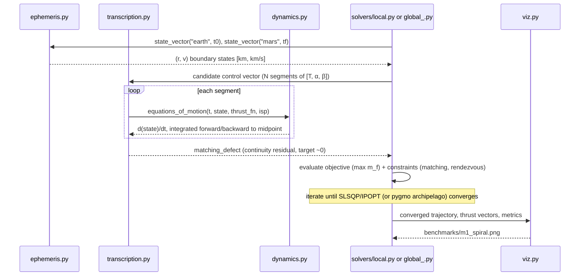
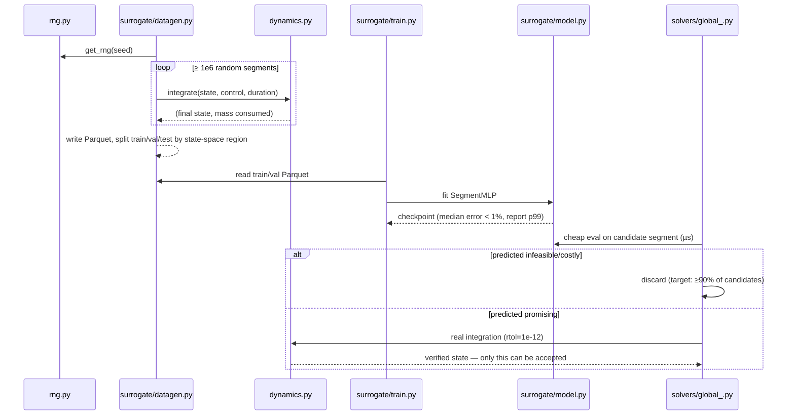

# Data flow

This describes how a state vector moves through the system for the two
pipelines the project defines: the classical solve (Phases 0–2) and the
surrogate-assisted solve (Phase 3). See
[`overview.md`](overview.md) for the static module map these flows run
through, and [`numerical-methods.md`](../numerical-methods.md) for the
equations referenced below.

## 1. Classical solve (target for M1/M2)

Key points:

- **Boundary states come from `ephemeris.py` in SI units (km, km/s)**; the
  moment they enter `transcription.py`/`dynamics.py` they're expected in
  canonical units (`DU`, `TU` — see
  [`ADR-0003`](../adr/0003-canonical-units.md)). SI-to-canonical conversion
  is a boundary concern, not something the solver internals should ever do
  themselves.
- **Sims-Flanagan matching is a per-segment forward/backward shoot to a
  midpoint**, not a single forward integration — this is what
  `transcription.matching_defect` computes and what the NLP drives to zero
  alongside the rendezvous constraint. See the
  [glossary entry](../domain/glossary.md#trajectory-optimization).
- **`solvers/local.py` and `solvers/global_.py` are two front-ends onto the
  same problem**, not two different problems — per T-2.1 they must not
  duplicate the objective/constraint definition that wraps
  `transcription.py`.
- **T-1.9 (final integration check) is not shown as a separate box because
  it *is* `dynamics.py`**, called once more after convergence at
  `rtol=1e-12` instead of the transcription's coarser per-segment
  integration. No solution is published without this step
  (`PLAN.md §3`).

## 2. Surrogate-assisted solve (target for Phase 3)

Key points:

- **The train/val/test split is by region of state space, not random**
  (`PLAN.md T-3.2`) — the whole point is measuring whether the model
  generalizes across the trajectory space, not whether it memorized it.
- **`datagen.py` and the classical solve both call into `dynamics.py`**, so
  a correctness bug fixed in one path is fixed in both — this is why
  Phase 0/1's energy-conservation and Hohmann tests are non-negotiable
  gates before *anything* downstream (surrogate included) can be trusted.
- **The screening step never mutates what gets accepted** — it only decides
  what gets a real integration. This is the architectural expression of the
  "surrogate never has the final word" rule in
  [`overview.md §3`](overview.md#3-the-two-tier-execution-architecture-phase-3-target).

## 3. What's out of scope for both flows today

Live network calls (to Horizons or anything else) at run time, multi-body
perturbations (J2, SRP), and 3-body dynamics are all explicitly out of
scope until at least M3 — see `PLAN.md`'s frozen backlog. No data flow in
this document should be read as implying otherwise.
