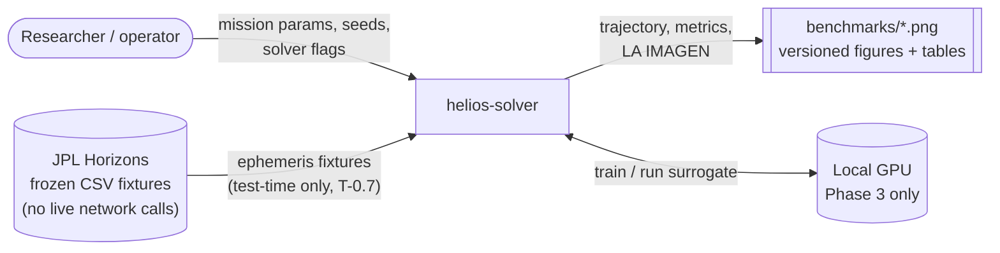
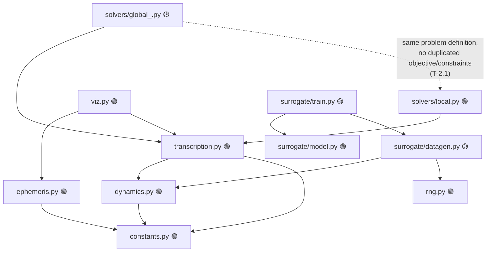
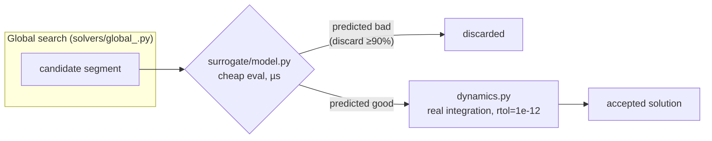

# Architecture overview

> Status legend used throughout this doc: 🟢 implemented · 🟡 stub (signature
> + docstring only, raises `NotImplementedError`) · ⚪ not started.
> Checked against the repo as of Gate 0→1 closing + E1-E4 (first four
> realism-ladder rungs, see [`ADR-0004`](../adr/0004-realism-ladder.md))
> solved — re-verify against `src/helios/` before trusting this if it's
> been a while.

## 1. System context

`helios-solver` is a batch/offline research tool, not a service. It has no
network-facing component and no persistent runtime; a "run" is a Python
process (script, notebook, or eventually a CLI) that produces a trajectory
and a figure, or (Phase 3) a trained surrogate checkpoint.

Two architectural commitments follow directly from this, both load-bearing
for reproducibility (see [`ADR-0002`](../adr/0002-environment-manager.md),
[DoD in `PLAN.md §8`](../../PLAN.md#8-definition-of-done-aplica-a-toda-tarea)):

- **No network calls in CI.** Ephemeris validation (T-0.7) runs against a
  fixture frozen from Horizons once, not a live query — see
  [`data-flow.md`](data-flow.md).
- **Every run is seed-driven.** All randomness — multi-start seeds, Phase 3
  data generation — goes through `helios.rng.get_rng()`
  ([`glossary`](../domain/glossary.md#determinism--reproducibility)).

## 2. Module map

Notes:

- `constants.py` and `rng.py` are the only two modules with zero internal
  dependencies and zero remaining stub surface — everything else is built on
  top of them, by design (physical constants and RNG are the two things
  every other module must not reimplement).
- `model.py` (the `SegmentMLP` class) is structurally complete because it's
  pure PyTorch plumbing; it has nothing to be "wrong" about until `train.py`
  and `datagen.py` (which feed it) exist.
- `solvers/global_.py`'s dependency on `local.py` is conceptual, not an
  import: [`PLAN.md T-2.1`](../../PLAN.md#4-fase-2--búsqueda-global) requires
  the local (SLSQP/IPOPT) and global (pygmo) solvers to share one objective
  and constraint definition, most likely by both wrapping
  `transcription.py` rather than one importing the other. This diagram will
  need correcting once T-2.1 lands with an actual shape.
- `viz.py`'s dependencies are inferred from its function signature
  (`plot_trajectory` takes Earth/Mars orbits and a transfer trajectory), not
  from an existing import — nothing calls it yet.

## 3. The two-tier execution architecture (Phase 3 target)

The project's central bet ([`IDEA.md §1`](../../IDEA.md)) is that most
global-search wall-clock time is spent integrating ODEs for candidates that
turn out to be bad. The target architecture for Phase 3
([`PLAN.md §5`](../../PLAN.md#5-fase-3--surrogate-neuronal)) is a two-tier
screen: the surrogate proposes, the integrator disposes.

**Hard rule carried over from `IDEA.md §7` / `PLAN.md §5`: the surrogate
never has the final word.** It filters; the integrator is the only thing
that can accept a solution. This is not an optimization detail — it is the
mechanism that keeps a fast-but-wrong model from silently producing a
trajectory that looks plausible and isn't (see
[`numerical-methods.md`](../numerical-methods.md) for why that failure mode
is the project's stated top risk).

## 4. What's deliberately not architected yet

Per the realism ladder ([`ADR-0004`](../adr/0004-realism-ladder.md)), 3D
ephemerides, free launch windows, and the surrogate are all *later* rungs.
Designing their architecture in detail now would be scope creep against the
project's own rule (`PLAN.md §9`, risk: *"Scope creep... al backlog
congelado, sin discusión"*). This doc will grow a section per phase as that
phase's gate opens, not before.
